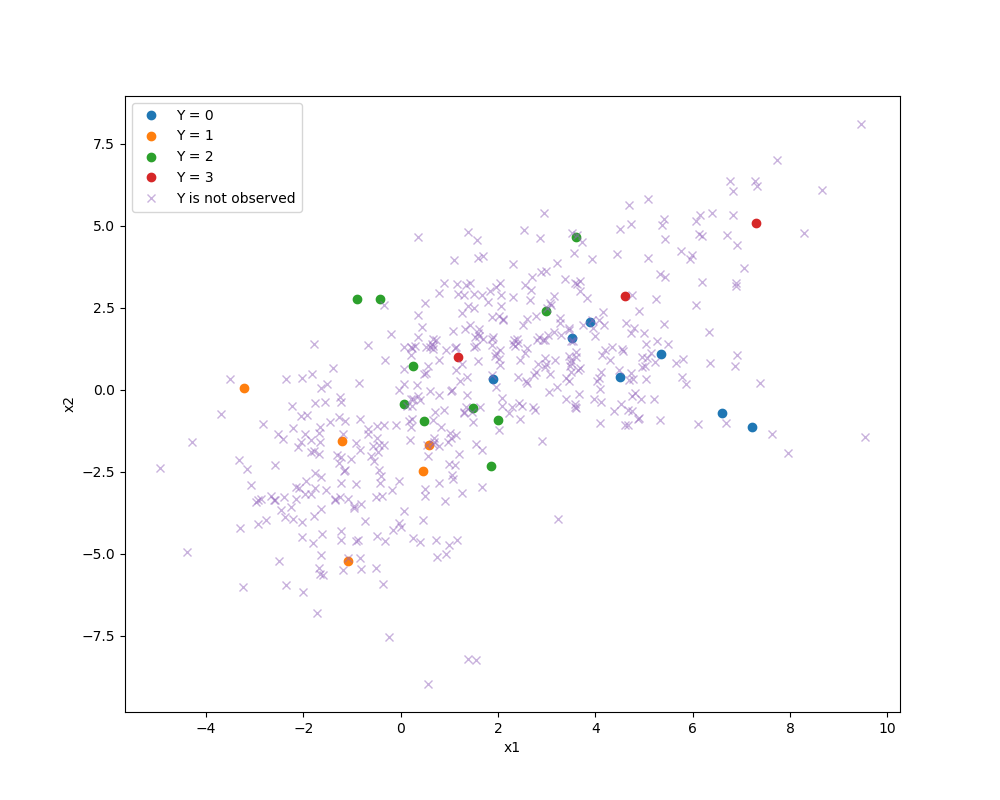
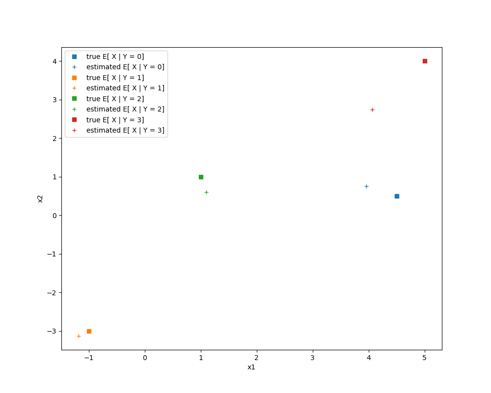

# semi_supervised_gmm

Related:
 - https://www.cs.ubc.ca/~schmidtm/Courses/540-W16/EM.pdf
 - https://www.cs.cmu.edu/~epxing/Class/10708-15/notes/10708_scribe_lecture8.pdf
 - https://normaldeviate.wordpress.com/2012/08/04/mixture-models-the-twilight-zone-of-statistics/
 - https://hastie.su.domains/ElemStatLearn/printings/ESLII_print12.pdf (8.5 The EM Algorith)

[simulation.py](simulation.py)

This code simulates data from a Gaussian mixture model or GMM
and then estimates parameters using predictors `X1, X2` that are fully observed and
and class labels `Y` that are partially observed.
Unobserved Ys are encoded as NaNs.
(In the "classic" GMM setting, `Y` is entirely unobserved, and the model is fit using only the `X`s.)

The estimated model is used to predict Pr[ Y | X ] on a test set.

